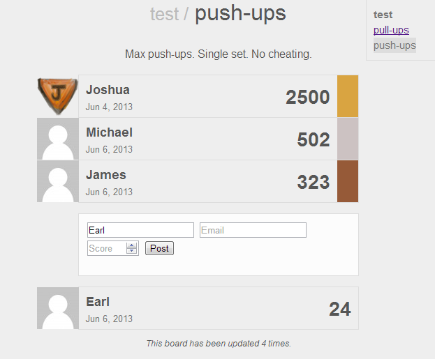
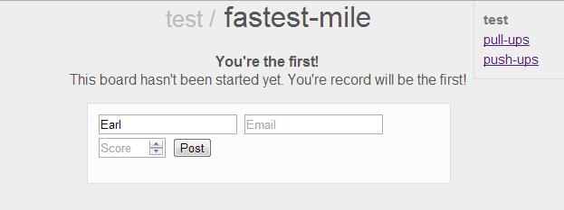

Mostly I just read about new programming languages. Call it a hobby. Only once in awhile am I struck with enough interest to want to try something out on a real project. [Go](http://golang.org) is the most recent of such interests. As someone who loves a lot about [Node.js](http://nodejs.org), I'm looking forward to seeing how Go compares and whether it solves my Node and JavaScript pain points.

**Scores** is my first app in Go. It is a very simple scoreboard app for "tracking personal records between friends". You define a record like "max push-ups" and you create a scoreboard for it. The scoreboard is specific to your group of friends or "team".

You [try out a test scoreboard](http://scores.zduck.com/test/push-ups) or dive in and [create your own board](http://scores.zduck.com).

Anyone with the URL of your scoreboard can post scores. Only the top 10 scores are kept. Obviously it is wide open to trolls so you probably won't want to share your scoreboard URL publicly.

I think this is a pretty fun and useful app and I'd love to know what you think! Please take it for a run, invite your friends to compete with you for a high score.

If it gains some interest then my plan is to keep this running and improve the code overtime as I learn more Go. Honestly, the improvement part will probably happen regardless. The primary goal of this project is to try out Go in a real app and I've already got a laundry list of things to improve.

I encourage you to [read the source](http://github.com/jpoehls/scores) and comment. **Please, do not take this as a great example of idiomatic Go code.** This is a work in process from someone learning the language. Take it as such.

## Why Go?

You may be curious about what attracted me to Go. It is a very simple language. In a way, it was designed to have a lack of features rather than an abundance. While many languages take the stance that giving the developer more ways to do something makes their job easier, Go says this is wrong. Less is more. More features introduce disparate coding styles and make it difficult to maintain consistency. You can look at 2 or 10 different projects in some languages and feel, largely, like you are reading 2 or 10 different languages simple due to style changes or which features of the language the APIs are designed around.

In short, Go was designed to make developer's quality of life better. Clearer code, faster builds, great tooling.

I'm a sucker for simplicity and I'm a big sucker for great tooling. Developer tooling is a passion of mine and Go has made this a top priority. Built-in [memory and CPU profiler](http://blog.golang.org/profiling-go-programs), [deadlock and race detection](http://golang.org/doc/articles/race_detector.html), [documentation generator](http://golang.org/doc/articles/godoc_documenting_go_code.html) that supports [executable example code](http://golang.org/pkg/strings/#Split), built-in [testing and benchmarking](http://golang.org/pkg/testing/), a Go language [parser and lexer in the standard library](http://golang.org/pkg/go/); these things excite me.

I'm not going to elaborate more on Go because, honestly, I'm a total noob. I've been following the project for awhile but only started writing code recently and am just now working on an actual app. Thus, my opinions on the language and its benefits over the long-haul are very weak. Try it for yourself and make your own opinions.

If this sounds interesting to you then I encourage you to watch a couple of videos to get a feel for the philosophy and tooling of Go.

* [Go: a simple programming environment](https://vimeo.com/53221558) - Andrew Gerrand, November 2012
* [Go at Google](http://www.infoq.com/presentations/Go-Google) - Rob Pike, October 2012

So, what do you think of Go? Let me know! And don't forget to [create a scoreboard](http://scores.zduck.com) and let me know what you think of that as well!